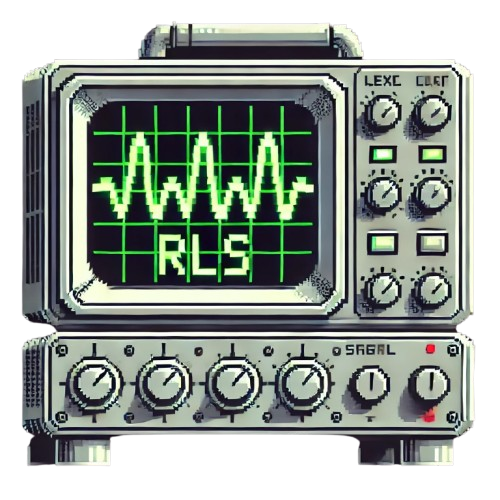

<p align="center"></p>

## Overview

RLS Scope is a tool that automates the generation and execution of pgTAP test cases for your Supabase Row-Level Security (RLS) policies using AI. It parses existing RLS policies from your Supabase database and generates comprehensive test files to ensure your policies are functioning as intended.

> [!CAUTION]  
> This tool is meant to help catch permissive RLS policies, however it does not guarantee correctness and it is not a substitute for due diligence. Always remember to review your RLS policies!

## Prerequisites

- [**pgTAP**](https://pgtap.org/) - Unit testing framework for PostgreSQL
- [**dbdev**](https://database.dev/) - Development environment for database projects
- [**supabase-test-helpers**](https://github.com/supabase/supabase-test-helpers) - Helper functions for testing Supabase policies
- [**Claude API Key**](https://anthropic.com/) - Required for AI-generated test cases
- [**Bun**](https://bun.sh/) - A fast all-in-one JavaScript runtime
- [**Supabase CLI**](https://supabase.com/docs/reference/cli) - Tooling for managing Supabase projects
- [**Docker**](https://www.docker.com/) - Containerization platform. Docker must be running to use `supabase db test`

## Environment Variables

Copy the `.env.example` file to `.env` and fill in the values from the Supabase dashboard and add your Claude API Key:

```bash
cp .env.example .env
```

Update the `.env` file with your Supabase database credentials and Claude API Key.

**Note:** Do not commit your `.env` file or any secrets to version control.

## Dependency Installation

Install the project dependencies using Bun:

```bash
bun install
```

## Getting Started

To run the application and generate the automated test cases, cd into the project directory and run:

```bash
bun start
```

This command will:

1. Connect to your Supabase database using the provided credentials.
2. Fetch all existing RLS policies.
3. Generate pgTAP test files for each policy using Claude AI.
4. Save the test files in the `supabase/tests` directory.

## Running the Tests

After generating the test cases, you can execute them using the Supabase CLI:

```bash
npx supabase db test --linked
```

The `--linked` flag runs the tests against your remote Supabase project instead of a local database. Make sure you have linked your project first using:

```bash
supabase link
```

**Note:**

- You'll need your project's reference ID (or name) and database password from the Supabase dashboard to link your project successfully.

- This command runs all SQL test files located in the `supabase/tests` directory.

## Model Providers

Currently, the only supported model is Claude because Anthropic provided free credits for the Supabase AI Hackathon in which this project was developed. If you prefer to use a different model provider like ChatGPT, LLaMa, or Gemini, please submit a pull request.

## Documents in the Corpus

The most relevant document is the bad-examples-guide which is meant to steer the LLM away from incorrect code which it has written in the past.

Supabase-test-guide describes proper testing on Supabase with pgTAP.

Supabase-test-helpers describes the supabase-test-helper functions which are available through the TLE and necessary for testing RLS policies.

## Contributing Guidelines

Contributions are welcome! Please open an issue or submit a pull request with your improvements. We are working towards following the [Contributor Covenant](https://www.contributor-covenant.org/)

## License

This project is licensed under the MIT License.
